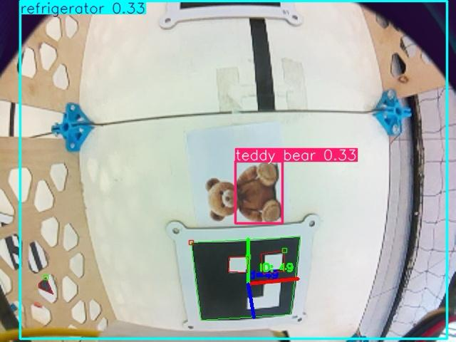
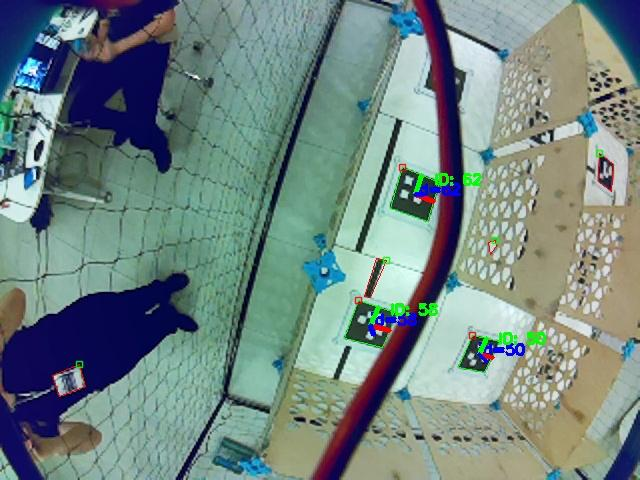
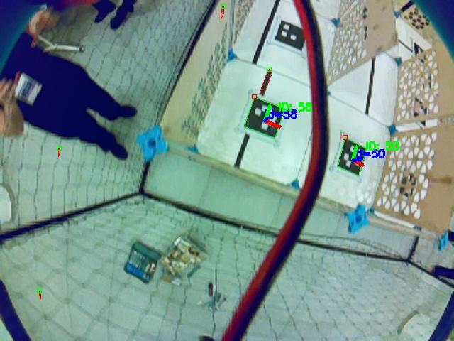
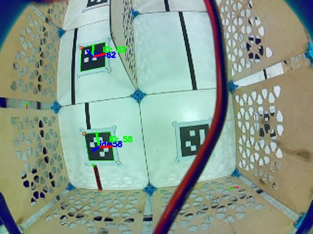
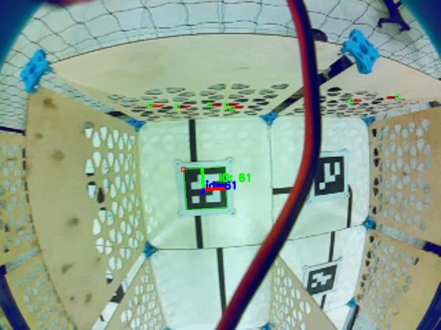
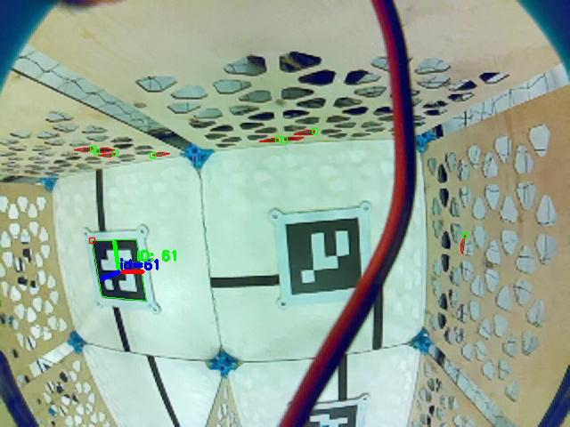
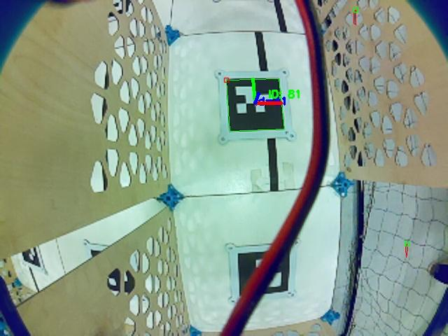

# Ros2Drun


## 1. Заголовок и краткое описание проекта

**Ros2Drun** — автономная миссия для квадрокоптера на ROS 2 + PX4 Offboard. Дрон взлетает, проходит маршрут по лабиринту, снимает кадры с бортовой камеры и после посадки ищет целевые объекты через YOLOv8.

Проект создан в рамках хакатон-интенсива **«Автономные дроны и бортовой ИИ» от Сверх**. С этим решением команда заняла **1 место**: максимальный балл был получен за стабильный полет по заранее заданной «змейке» в относительных координатах `body`, съемку кадров и последующую обработку снимков на борту.

## 2. Установка и запуск проекта

### 2.1. Предварительные требования

Железо и платформа:

- квадрокоптер с PX4 и включенным Offboard-управлением;
- бортовой компьютер с ROS 2: Raspberry Pi CM5, Radxa CM5 или совместимая плата;
- камера, опубликованная в ROS 2 как `sensor_msgs/Image`;
- связь PX4 с ROS 2 через uXRCE-DDS / MicroXRCEAgent.

ROS 2-окружение должно предоставлять:

- `rclpy`;
- `sensor_msgs`;
- `std_srvs`;
- `cv_bridge`;
- `offboard_interfaces`;
- сервисы `/navigate`, `/land`, `/get_telemetry`;
- топик камеры `/aruco_det/debug_image`.

`offboard_interfaces` не устанавливается через `pip`: это ROS 2-пакет из workspace с Offboard-контуром.

Подробности по настройке платформы:

- `docs/fcu.md` — подключение полетного контроллера и MicroXRCEAgent;
- `docs/offboard.md` — сервисы Offboard-ноды;
- `docs/cm5_rpi_tutorial.md` — Raspberry Pi CM5;
- `docs/cm5_radxa_tutorial.md` — Radxa CM5.

### 2.2. Клонирование репозитория

```bash
git clone https://github.com/MorS1337/sverkh_ros_hack
cd sverkh_ros_hack
```

### 2.3. Подключение ROS 2 workspace

Замените `humble` на свою версию ROS 2, если используете другую.

```bash
source /opt/ros/humble/setup.bash
source ~/sverk_ws/install/setup.bash
```

В `~/sverk_ws` должны быть собраны Offboard-нода и интерфейсы, которые дают сервисы `/navigate`, `/land`, `/get_telemetry`.

### 2.4. Системные зависимости

На Ubuntu/ROS 2:

```bash
sudo apt update
sudo apt install -y \
  python3-pip \
  python3-venv \
  python3-opencv \
  ros-$ROS_DISTRO-rclpy \
  ros-$ROS_DISTRO-cv-bridge \
  ros-$ROS_DISTRO-sensor-msgs \
  ros-$ROS_DISTRO-std-srvs
```

Если переменная `$ROS_DISTRO` пустая, сначала выполните `source /opt/ros/<ваша_версия>/setup.bash`.

### 2.5. Python-зависимости

Важно создать venv с `--system-site-packages`, чтобы Python видел ROS 2-пакеты (`rclpy`, `cv_bridge`, `sensor_msgs`).

```bash
python3 -m venv --system-site-packages venv
source venv/bin/activate
python -m pip install --upgrade pip
python -m pip install -r requirements.txt
```

### 2.6. Подготовка папок для результатов

```bash
mkdir -p photos detections
```

### 2.7. Запуск PX4/Offboard-контура

На борту или в симуляции должны быть подняты MicroXRCEAgent и Offboard-нода.

Терминал 1, мост PX4 → ROS 2:

```bash
MicroXRCEAgent serial --dev /dev/ttyUSB0 -b 921600
```

Терминал 2, Offboard-нода:

```bash
ros2 run offboard_control offboard_control
```

Проверка сервисов:

```bash
ros2 service list | grep -E '/(navigate|land|get_telemetry)$'
```

### 2.8. Запуск финальной миссии

В отдельном терминале:

```bash
cd sverkh_ros_hack
source /opt/ros/humble/setup.bash
source ~/sverk_ws/install/setup.bash
source venv/bin/activate
python body_drun.py
```

`body_drun.py` запускает финальный хакатонный сценарий: взлет с `auto_arm=True`, полет по «змейке» через относительные смещения в `body`, фоновую съемку и обработку снимков после посадки.

### 2.9. Альтернативный запуск стратегий

`main.py` оставлен как переключаемая точка входа для подходов, которые мы перебирали во время разработки.

```bash
cd sverkh_ros_hack
source /opt/ros/humble/setup.bash
source ~/sverk_ws/install/setup.bash
source venv/bin/activate
python main.py
```

По умолчанию в `main.py` выбран сценарий `ArucoFramesDroneController`. Чтобы переключить режим, закомментируйте текущую стратегию и раскомментируйте нужную:

```python
strategy = ArucoFramesDroneController(markers=ARUCO_MARKERS)
# strategy = PointsFlightDroneController(points=POINTS)
# strategy = LuckyFlightDroneController(moves=MOVES)
```

После завершения полета `main.py` также запускает распознавание снимков.

### 2.10. Запуск только распознавания

Если снимки уже лежат в `photos/`, можно отдельно прогнать YOLO:

```bash
source venv/bin/activate
mkdir -p detections
python -c "from recognize import RecognizeImage; RecognizeImage().start()"
```

### 2.11. Контейнеры

Готового `Dockerfile`/`docker-compose.yml` в репозитории нет, потому что финальная сборка зависит от конкретного бортового компьютера, камеры и способа подключения FCU. Инструкции для подготовки окружения под Raspberry Pi CM5 и Radxa CM5 лежат в `docs/`.

## 3. Основной функционал проекта

- Автономный взлет и посадка через ROS 2-сервисы Offboard.
- Переключаемые стратегии миссии: `aruco_map`, список точек, относительные смещения в `body`.
- Финальный стабильный маршрут по «змейке» без зависимости от детекции ArUco-меток во время полета.
- Потоковая телеметрия и контроль состояния дрона во время миссии.
- Получение изображения из ROS-топика камеры `/aruco_det/debug_image`.
- Сохранение снимков миссии в `photos/`.
- Постобработка снимков через YOLOv8.
- Поиск целевых объектов `orange` и `teddy bear`.
- Сохранение кадров с bounding boxes в `detections/`.

## 4. Технологии и инструменты

- **Python 3.10+** — логика миссий, интеграция ROS 2 и CV-пайплайн.
- **ROS 2** — коммуникация между бортовым кодом, камерой и Offboard-контуром.
- **PX4 Offboard** — управление дроном через внешние setpoint-команды.
- **uXRCE-DDS / MicroXRCEAgent** — мост между PX4 и ROS 2.
- **OpenCV + cv_bridge** — получение и сохранение кадров с ROS-камеры.
- **Ultralytics YOLOv8** — детекция объектов на снимках.
- **NCNN** — формат экспортированной модели для более легкого инференса.
- **Raspberry Pi CM5 / Radxa CM5 / Matek H743 Mini V3** — целевые аппаратные платформы из документации проекта.

## 5. Команда проекта

- **Буянов Петр** — полетная логика, тестирование миссий, интеграция решения на платформе.
- **Морев Семен** — компьютерное зрение, проверка детекции, документация.
- **Табаков Максим** — ROS 2/PX4-интеграция, структура проекта, тестирование сценариев.

Команда работала в режиме общего владения проектом: участники совместно занимались настройкой окружения, отладкой полета и финальной интеграцией.

## 6. Архитектура и структура проекта

### 6.1. Почему выбран финальный подход

Во время разработки мы проверили два подхода к прохождению лабиринта:

- **навигация по ArUco-меткам** — более гибкий подход, но качество полета зависит от стабильности детекции меток, освещения и видимости маркеров;
- **заранее заданный маршрут в относительных координатах** — более простой подход, но для трассы хакатона он оказался надежнее: лабиринт нужно было пройти «змейкой», сохраняя локализацию и не останавливаясь на распознавание меток.

Финальный скрипт был написан за два дня до защиты. Изначально он не прошел трассу, но на защите мы поправили автоарминг при взлете, после чего дрон уверенно пролетел маршрут и сделал снимки. YOLOv8n запускалась уже во время приземления/после полета, чтобы не нагружать процессор в критический момент управления дроном.

### 6.2. Архитектура

```mermaid
flowchart LR
    A[body_drun.py] --> B[Body Snake Mission]
    B --> C[DroneController ROS2 Node]
    C --> D[/navigate auto_arm=true]
    C --> E[/get_telemetry]
    C --> F[/land]
    C --> G[/aruco_det/debug_image]
    G --> H[photos/shot_*.jpg]
    H --> I[recognize.py]
    I --> J[YOLOv8n NCNN]
    J --> K[detections/found_*.jpg]
```

### 6.3. Структура проекта

```text
.
├── body_drun.py                # финальная body-миссия: змейка, автофото, распознавание
├── main.py                     # альтернативный запуск: выбор стратегии полета + распознавание
├── drone_controller.py         # базовый ROS 2-контроллер: сервисы, телеметрия, камера
├── aruco_frames_flight.py      # маршрут по точкам в aruco_map
├── points_flight.py            # маршрут по списку координат
├── lucky_flight.py             # маршрут по относительным смещениям
├── recognize.py                # постобработка снимков через YOLOv8
├── requirements.txt            # Python-зависимости
├── LICENSE                     # лицензия проекта
├── yolov8n.pt                  # исходная YOLOv8n-модель
├── yolov8n_ncnn_model/         # экспорт YOLOv8n в NCNN для инференса
└── docs/
    ├── demo/                   # кадры для демонстрации в README
    └── *.md                    # заметки по FCU, Offboard, CM5/Radxa/Raspberry Pi
```

## 7. Демонстрация работы проекта

В проекте нет веб-интерфейса, поэтому GitHub Pages/Netlify/Heroku не применимы. Демонстрация — это видео реального запуска миссии и сохраненные кадры с камеры.

- Видео хакатона: https://t.me/sverk_official/122
- Кадры с дрона после запуска сохраняются в `photos/shot_*.jpg`.
- Результаты распознавания сохраняются в `detections/found_shot_*.jpg`.
- Примеры кадров миссии лежат в `docs/demo/`.

### Кадры с бортовой камеры

<p align="center">
  
  
  
</p>

<p align="center">
  
  
  
</p>

<p align="center">
  
</p>

## 8. Финальный текст-заключение

Ros2Drun интересен тем, что это не отдельная ML-модель и не симуляционный скрипт, а полный контур автономной миссии: команда взлета, навигация, телеметрия, съемка, посадка и последующий анализ сцены. В финальном решении мы сознательно выбрали более простой маршрут в относительных координатах, потому что для конкретной трассы он дал лучшую устойчивость, чем зависимость от распознавания ArUco-меток в полете.

Возможные улучшения:

- перенести распознавание из post-processing в online-режим во время полета;
- выбирать следующую точку маршрута на основе результатов детекции;
- вынести маршруты, целевые классы и ROS-топики в YAML-конфиг;
- добавить launch-файл для полного старта миссии;
- добавить Docker/compose-окружение под конкретную бортовую платформу;
- сохранять телеметрию миссии вместе с кадрами и результатами детекции.

## 10. Лицензия

Код проекта распространяется под лицензией **MIT**. Текст лицензии доступен в файле `LICENSE`.

Сторонние зависимости и модели сохраняют собственные лицензии. В частности, используемая Ultralytics YOLOv8-модель и ее NCNN-экспорт связаны с лицензией **AGPL-3.0**, указанной в `yolov8n_ncnn_model/metadata.yaml`.
